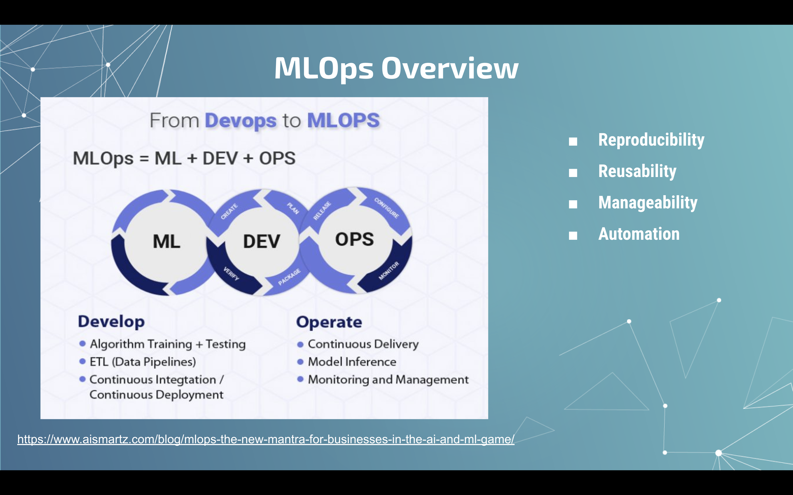
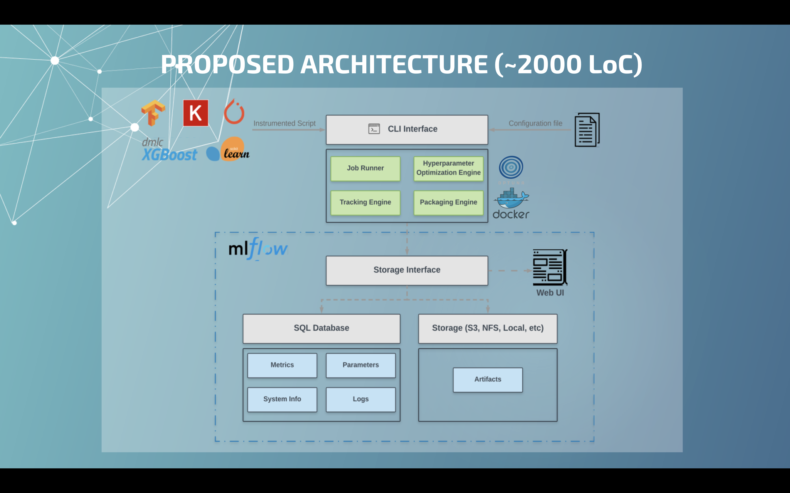

# Design and implementation of ml-experiment: a framework for MLOps.

### Summary

Nowadays, data science projects are usually developed in an unstructured way, which makes it difficult to reproduce. It is also hard to move from an experimental environment to production.
Operational workflows such as containerization, continuous deployment, and cloud orchestration allow data science researchers to move a pipeline from a local environment to the cloud.
Being aware of the difficulties of setting those workflows up, this paper presents a framework to ease experiment tracking and operationalizing machine learning by combining existent and well-supported technologies. These technologies include Docker, Mlflow, Ray, among others.
The framework provides an opinionated workflow to design and execute experiments either on a local environment or the cloud. ml-experiment includes: an automatic tracking system for the most famous machine learning libraries: Tensorflow, Keras, Fastai, Xgboost and Lightgdm, first-class support for distributed training and hyperparameter optimization, and a Command Line Interface (CLI) for packaging and running projects inside containers.

### [Project Page](https://github.com/aguillenATC/ml-experiment)

### [Slides](https://docs.google.com/presentation/d/1tm2GW3SznarH9FoThwc1pUgiTu9HzpGwWbd0fVQalCQ/edit?usp=sharing)

### Example Slides

